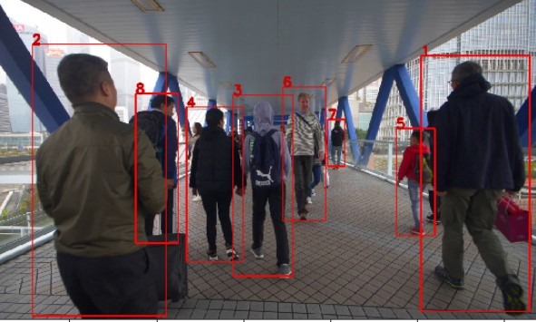

# Person-Reidentification

“Given an image/video of a person taken from one camera, re-identification is the process of identifying the person from images/videos taken from a different camera with non-overlapping fields of views. Re-identification is indispensable in establishing consistent labeling across multiple cameras or even within the same camera to re-establish disconnected or lost tracks.” 

<small><i>Table of Contents</i></small>
- [Our Approach](#our-approach)
- [Methods](#methods)
- [How to use?](#how-to-use-)
- [Dataset](#dataset)
- [Research Papers:](#research-papers-)
- [Github Repositories:](#github-repositories-)

## Our Approach
To solve the stated problem, we used two approaches:

**Person Re-identification using feature mapping:**
*	A resnet50 model is trained on openly available Market 1501 dataset
*	Trained on 12186 images
*	Validated on 751 images
*	Trained for 15 epochs
*	Pytorch framework used at the backend
*	We use the model to generate the feature map of each individual present on the image and store the feature map in the database after assigning the id.
*	This model returns a vector of size (512, 1)

**Person Re-identification by Attribute-Assisted Appearance**
*	Trained a resnet50 model on RAP v2.0 (Richly Annotated Dataset for Pedestrian Attribute Recognition) having 84929 well annotated images
*	Rap v2.0 is not freely available and we had to sign an agreement to use this dataset
*	The author of the paper https://www.researchgate.net/publication/301817457_A_Richly_Annotated_Dataset_for_Pedestrian_Attribute_Recognition, Dangwei Li helped us with the dataset
*	We trained our model to identify 82 attributes as follows:
[Female, AgeLess16, Age17-30, Age31-45, Age46-60, BodyFat, BodyNormal, BodyThin, Customer, Employee, hs-BaldHead, hs-LongHair, hs-BlackHair, hs-Hat, hs-Glasses, ub-Shirt, ub-Sweater, ub-Vest, ub-TShirt, ub-Cotton, ub-Jacket, ub-SuitUp, ub-Tight, ub-ShortSleeve, ub-Others, ub-ColorBlack, ub-ColorWhite, ub-ColorGray, up-ColorRed, ub-ColorGreen, ub-ColorBlue, ub-ColorSilver, ub-ColorYellow, ub-ColorBrown, ub-ColorPurple, ub-ColorPink, ub-ColorOrange, ub-ColorMixture, ub-ColorOther, lb-LongTrousers, lb-Skirt, lb-ShortSkirt, lb-Dress, lb-Jeans, lb-TightTrousers, lb-ColorBlack, lb-ColorWhite, lb-ColorGray, lb-ColorRed, lb-ColorGreen, lb-ColorBlue, lb-ColorSilver, lb-ColorYellow, lb-ColorBrown, lb-ColorPurple, lb-ColorPink, lb-ColorOrange, lb-ColorMixture, lb-ColorOther, shoes-Leather, shoes-Sports, shoes-Boots, shoes-Cloth, shoes-Casual, shoes-Other, attachment-Backpack, attachment-ShoulderBag, attachment-HandBag, attachment-Box, attachment-PlasticBag, attachment-PaperBag, attachment-HandTrunk, attachment-Other, action-Calling, action-Talking, action-Gathering, action-Holding, action-Pushing, action-Pulling, action-CarryingByArm, action-CarryingByHand, action-Other]
*	Trained a resnet50 model and got a MAP (Mean Average Precision of 71%)
*	Trained on 67,433 images
*	Validated on 16,589 images
*	Trained for 100 epochs
*	Model returns a vector of size (82, 1)

## Methods
We used the combinations of two above defined approaches in two ways:

**Method 1**
* First model extract feature vector and another model extract attribute vector
* We use two python pandas data frames:
  * all_frame_df stores feature vector, attribute score and previously assigned Id for all the individuals
  * unique_id_df stores only unique feature vector, attribute score and previously assigned Id for every individual
* Whenever a person comes in an image, we extract the feature vector and the attribute vector for it and compare with feature vectors and attribute vectors present in the unique_id_df
* For comparison we use Spatial Cosine distance between the vectors and assign the same identity if the similarity result crosses the threshold value or else assign a new identity

**Drawbacks of Method 1:**
* Model assigns the same id only if the image of individual crosses both the threshold value (Feature threshold and Attribute threshold) at the same time otherwise it assigns a different ID
* Hence if an image crosses only one of the threshold values then it assigns a different ID.

**Method 2**
* To overcome the limitations of method1 we came up with method2
* First model extract features and other attribute vectors
  * First model (Feature Model) recommends two most similar already seen person, crossing the feature similarity threshold value
  * Second model (Attribute Model) recommends only one most similar already seen person, crossing the attribute similarity threshold value
* We then compare the 3 recommended ids if any and take the decision as follows:
  * Return the most frequent id
  * Or the one with highest similarity score in case they are different
  * Assign new Id if above conditions are not fulfilled

**Drawbacks of Method 2:**
* Model assigns the same id for person who enter the scene from different corners. The reason is as corners are sometime have low illumination, the model recognizes them as same person and then the same id propagates even when the person walks to the center.
* The solution would be to train a classifier model that can classify person coming from the corners and assign a different unique ID or wait for 2-3 seconds from the moment it starts appearing in the frame and then assign an ID. We thought of doing it but fell short on time due to competition deadline, but we are committed to make it more accurate in the future

## How to use?
**Pre-requisites:**
  * Python 3.0 or above
  * Jupyter Notebook
  * Pytorch
  * Install the packages inside requirements.txt (pip install -r requirements.txt)
**Steps:**
  * For method1, run evaluation_method1.ipynb notebook
  * For method2, run evaluation_method2.ipynb notebook
  * Update the image folder and the csv file with coordinates at the top cell of each notebook
  * We have already executed the notebooks with our test data images and csv files.  (Images present in ‘data/’ folder and coordinates in ‘coordinates.csv’)
  *	Notebooks are self-explanatory
  * In case of any query(s) please feel free to reach out to us anytime.

## Dataset
* Market1501
* RAP V2.0 (Richly Annotated Dataset for Pedestrian Recognition

## Research Papers:
*	http://jankautz.com/publications/JointReID_CVPR19.pdf
*	https://www.researchgate.net/publication/301817457_A_Richly_Annotated_Dataset_for_Pedestrian_Attribute_Recognition
*	https://paperswithcode.com/paper/alignedreid-surpassing-human-level
*	https://paperswithcode.com/paper/a-strong-baseline-and-batch-normalization

## Github Repositories:
*	https://github.com/layumi/Person_reID_baseline_pytorch
*	https://github.com/dangweili/pedestrian-attribute-recognition-pytorch
*	https://github.com/wangxiao5791509/Pedestrian-Attribute-Recognition-Paper-List
*	https://github.com/hyk1996/Person-Attribute-Recognition-MarketDuke
*	https://github.com/yuange250/MARS-Attribute

